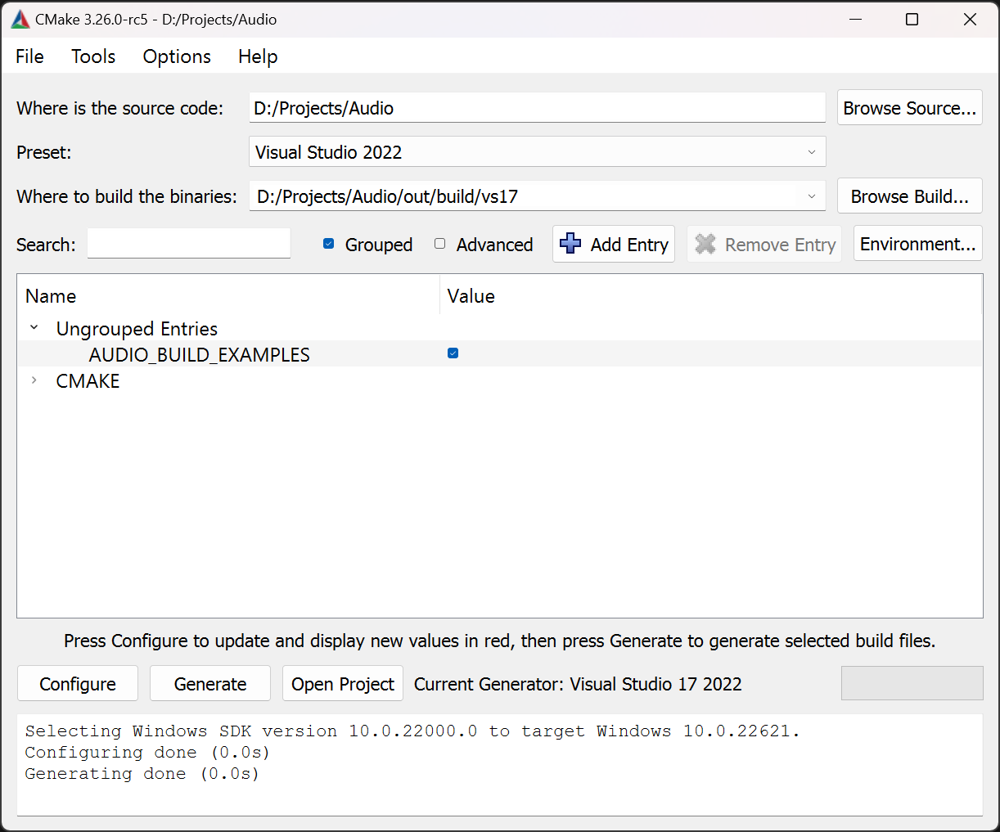

<!-- markdownlint-disable MD033 -->
# Audio Library

[](https://youtu.be/sXPN-QH1kwg)

A super minimalistic C++ audio library built on [miniaudio](https://miniaud.io/index.html).

## Features

Should work on most platforms, but I've only tested it on Windows.

The `Audio::Sound` class can be used to play one-shot sound effects and can also be used to stream background music to minimize memory use.

The `Sound` class supports the following file types:

* WAV (`.wav`): Waveform Audio File Format
* MP3 (`.mp3`): MPEG-1/2 Audio Layer III
* FLAC (`.flac`): Free Lossless Audio Codec
* OGG (`.ogg`): Free, Open Container Format ([Xiph.org](https://xiph.org/))

The `Audio::Waveform` class can be used to play waveform sounds. See [MarioCoin.hpp](example/MarioCoin.hpp) and [MarioCoin.cpp](example/MarioCoin.cpp) for an example of creating a complex sound effect using Waveforms.

## Installation

This project comes with both a Visual Studio 2022 solution and project file and a `CMakeLists.txt` file for use with CMake.

### Visual Studio 2022

Open the `Audio.sln` file in the root directory of this repository. You should see two projects in the solution:

1. Audio (Static library): This project generates the `Audio.lib` file that you must link to in your own project.
2. example (Executable): This is an example showing how to work with the Audio library. You can inspect the project settings of this project to see how to integrate the `Audio.lib` file into your own projects.

Running the example project in Visual Studio should play a narration and show a few examples of working with `Waveform`s.

### CMake

#### Windows

You should have (at least) CMake 3.23.0 installed (and added to your `PATH` environment variable in Windows). If you don't have CMake, please download it from [cmake.org](https://cmake.org/download/). Make sure you download the installer for your platform (don't download the source distributions).

To generate the Visual Studio solution and project files, run the [GenerateProjectFiles.bat](GenerateProjectFiles.bat) batch file on Windows. This script uses [vswhere](https://github.com/microsoft/vswhere) to detect the latest version of Visual Studio you have installed and will generate the solution and project files for the version of Visual Studio you have installed.

Alternatively, you can open the Audio folder directly in the CMake GUI to generate the solution and project files:



There is a preset (use the preset drop-down menu in the CMake GUI) for Visual Studio 2019 and 2022 that you can use to generate the solution and project files.

In the CMake GUI, use the **Configure**, **Generate**, and **Open Project** buttons (in that order) to generate and open the Visual Studio solution file.

#### Linux Based Platforms

CMake can usually detect your build toolchain on Linux based operating systems. To configure and build this project on Linux run the following commands from this project's root folder:

```bash
mkdir build
cd build
cmake ../
cmake --build .
```

This will build the **Debug** build by default. To build the **Release** library, use the following command:

```bash
cmake --build . --config Release
```

> **Note**: Do not distribute the CMake generated project files! These files contain absolute paths and will only work for your file structure.

## Build

Open either the existing [Audio.sln](Audio.sln) file, or the CMake generated solution file in Visual Studio.


Select **Build > Build Solution**  (<kbd>Ctrl</kbd>+<kbd>Shift</kbd>+<kbd>B</kbd>) from the main menu to build the `Audio.lib` and `example.exe`.

The `Audio.lib` file will go to the `lib` folder in the root of this repository depending on the current configuration.

* **Debug**: `lib\Debug\Audio.lib`
* **Release**: `lib\Release\Audio.lib`

> **Note**: Do not distribute the generated library file with your project or commit it to GitHub. The library file should always be compiled for the toolchain version where it will be used.

The `example.exe` file will be placed in the `bin` folder.

* **Debug**: `bin\Debug\example.exe`
* **Release**: `bin\Release\example.exe`

The example project should run directly from Visual Studio, but the example tries to open the [narrator.flac](example/narrator.flac) audio file in the [example](example/) folder. When running the `example.exe` file directly from the command line, you should also specify the [example](example/) folder as the current working directory when running:

```sh
.\bin\Release\example.exe -cwd ".\example"
```

If you see `Failed to initialize sound from source: narrator.flac` printed to the console, then the wrong working directory is being used to run the example. In this case, you will still hear the waveforms (since they don't rely on loading any files from disk), but you won't hear the narrator audio file.

## Integrating Into Your Own Project

To use the Audio library in your own projects, copy the `lib` and `inc` folders to a folder in your own project. For example, suppose you keep your 3rd party files in a folder called `extern` or `3rdParty`.

Create a subfolder called `Audio` and copy the contents of the `lib` and `inc` folders to the `Audio` subfolder. You should have a folder structure that is similar to what is shown in the screenshot below:


Or if you prefer a textual view:

```txt
├── MyDemoGame
│   ├── extern
│   │   ├── Audio
│   │   │   ├── inc
│   │   │   │   ├── Audio
│   │   │   │   │   ├── Config.hpp
│   │   │   │   │   ├── Device.hpp
│   │   │   │   │   ├── Listener.hpp
│   │   │   │   │   ├── Sound.hpp
│   │   │   │   │   ├── Vector.hpp
│   │   │   │   │   ├── Waveform.hpp
│   │   │   ├── lib
│   │   │   │   ├── Debug
│   │   │   │   │   ├── Audio.lib
│   │   │   │   │   ├── Audio.pdb
│   │   │   │   ├── Release
│   │   │   │   │   ├── Audio.lib
│   │   │   │   │   ├── Audio.pdb
```

Alternatively, you can just copy the contents of the [src](src/) folder to where you keep your source files (`.c`, or `.cpp` files) for your game project, and the contents of the [inc](inc/) folder to where you keep your header files (`.h` or `.hpp` files), then add all of the `.c` and `.cpp` files directly to your game project. Doing this does not require to generate the `Audio.lib` file and you can skip the next section.

### C/C++ Settings

In order for the compiler to find the include files, you need to tell the compiler where to find the additional header files.

Open the project settings for your game project (either by right-clicking on the project in Visual Studio, or select **Project > Properties** from the main menu in Visual Studio).

Expand the **C/C++** node in the Property Pages dialog box and select the **General** subnode.


In the **Additional Include Directories**, specify the folder to the `Audio\inc` folder you copied the header files to.

> **Note**: Make sure you set the **Configuration** to **All Configurations** to apply the include directory to all build configurations!

### Linker Settings

You must tell the linker where to find the `Audio.lib` file depending on the build configuration being used.

Open the project settings for your game project (either by right-clicking on the project in Visual Studio, or select **Project > Properties** from the main menu in Visual Studio).

Expand the **Linker** node in the Property Pages dialog box and select the **General** subnode.


In the **Additional Library Directories** setting, specify the folder to the `Audio\lib` folder you copied the `Audio.lib` files to.

> **Note**: The `$(Configuration)` macro shown in the screenshot will resolve to `Debug` when creating a debug build, and `Release` when building a release build. This way, you can specify the same path for all configurations.

Now select the **Input** subnode in the project's property pages dialog:


In the **Additional Dependencies** settings, specify `Audio.lib` for both the **Debug** and **Release** configurations.

You should be able to compile your project with the Audio library. If you have any issues, please join our Discord server: [3dgep.com Discord Server](https://discord.gg/gsxxaxc)

## Playing Sounds

The easiest way to get a sound effect in your game, is to load a sound effect file into an `Audio::Sound` object and use the `Sound::play` or `Sound::replay` (the former will automatically force the sound to play from the beginning in case it is already playing).

```cpp
#include <Audio/Sound.hpp>
...
// Create a Sound effect from a wav file:
Audio::Sound coin { "coin.wav" };
```

Later, the sound effect can be played using the `Sound::play` method:

```cpp
// Play the coin sound effect:
coin.play();
```

Or, if there is a chance the sound is already playing, it will not be restarted using the `Sound::play` method. This can happen if you play many coin sounds in rapid succession. To force the sound effect to play from the beginning, use the `Sound::replay` method:

```cpp
// Force the coin sound to play from the beginning:
coin.replay();
```

Use the `Sound::stop` method to force the sound effect to stop playing:

```cpp
// Stop the sound effect:
coin.stop()
```

> **Note**: Stopping a sound effect does not automatically rewind the sound effect to the beginning of the sound. Use the `Sound::seek` method to seek to the beginning of the sound. You can also use `Sound::replay` to automatically rewind the sound to the beginning.

## Spatial Audio

Sound effects can make use of spatial sound effects. A `Sound` has a position in 3D space relative to a `Listener`. In order to hear the correct spatial sounds, both the `Sound` and `Listener` must be set the correct position.

```cpp
#include <Audio/Device.hpp>
...
// Create a Sound effect from a wav file:
Audio::Sound coin { "coin.wav" };
// Set the position of the sound in the world.
coin.setPosition( {x, y, z} );
...
// Get a listener from the audio device.
Audio::Listener listener = Audio::Device::getListener();
...
// Position the listener based on the position of the player.
listener.setPosition( player.getPosition() );
// Optionally, you can also set the direction of the listener.
listener.setDirection( player.getDirection() );
```

Spatial audio allows you to specify the attenuation model for the sound effect. There are 4 attenuation models:

1. **None**: No attenuation. This is equivalent to disabling spatialization for the sound effect.
2. **Inverse**: Default attenuation that models natural sound attenuation.
3. **Linear**: Linear attenuation falloff (less natural, but might be better for 2D sound effects).
4. **Exponential**: Exponential attenuation.

The code snippet shows how to disable attenuation for a sound effect:

```cpp
sound.setAttenuation( Audio::Sound::AttenuationModel::None );
```

By default, both sounds and the listener have a position of {0, 0, 0}. In this case, the sounds will not exhibit any spatial attenuation.

## Playing Music

Short, one-shot sound effects are loaded into memory and decoded on creation. To minimize the impact on loading larger files, it is recommended to stream in the files and decode the audio file "on the fly" while playing. The reduces the time to load the file as well as reduced the amount of memory required to store the audio file.

```cpp
#include <Audio/Sound.hpp>
...
// Create a Sound effect from a wav file:
Audio::Sound bgMusic { "Background_Music.mp3", Audio::Sound::Type::Stream };
```

The only difference between loading background music and one-shot sound effects is the additional `Audio::Sound::Type::Stream` parameter in the constructor. Playing, stopping, and restarting of streamed sounds is the same as one-shot sound effects.

## Playing Waveforms

An `Audio::Waveform` class can be used to play waveform audio. Many early video games simulated sound effects using waveforms or [MIDI](https://en.wikipedia.org/wiki/MIDI) audio because it was much easier to store and synthesize the audio than use WAV files.

The `Audio::Waveform` class has two properties that can be modified at runtime to achieve the desired sound effect:

* **Frequency**: The "speed" of the waveform determines the apparent pitch of the sound. This value is measured in Hz.
* **Amplitude**: The "strength" of the sound and determines how loud it sounds. This value is a floating-point value that is measured in the range from 0 (no sound) to 1 (100% volume). Amplitude is modulated by the master volume of the `Audio::Device`.

See [MarioCoin.cpp](example/MarioCoin.cpp) for an example of how to use a Waveform.

## Known Issues

1. The destruction of the audio engine will hang when built as a shared library (DLL). This does not happen when building as a static library. The current workaround is to skip the call to `ma_engine_uninit` when the Audio library is built as a DLL.
